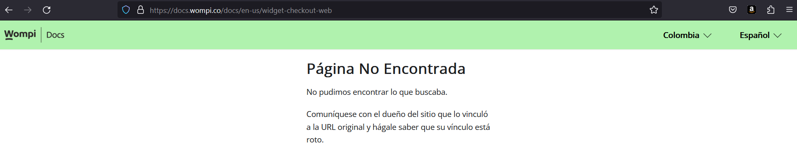

## IMPORTANT
At the time of implementing the functionality of the payment button,in the document provided the link is broken

# Getting Started with Create React App
### `npm install`
to install all dependencies .\

## Available Scripts
### `npm start`

Runs the app in the development mode.\

### `npm test`
Launches the test runner .\

### `npm run build`

Builds the app for production to the `build` folder.\
It correctly bundles React in production mode and optimizes the build for the best performance.

### Deployment
to see the project deployed in https://surge.sh/ go to the following address http://ablaze-rate.surge.sh/

